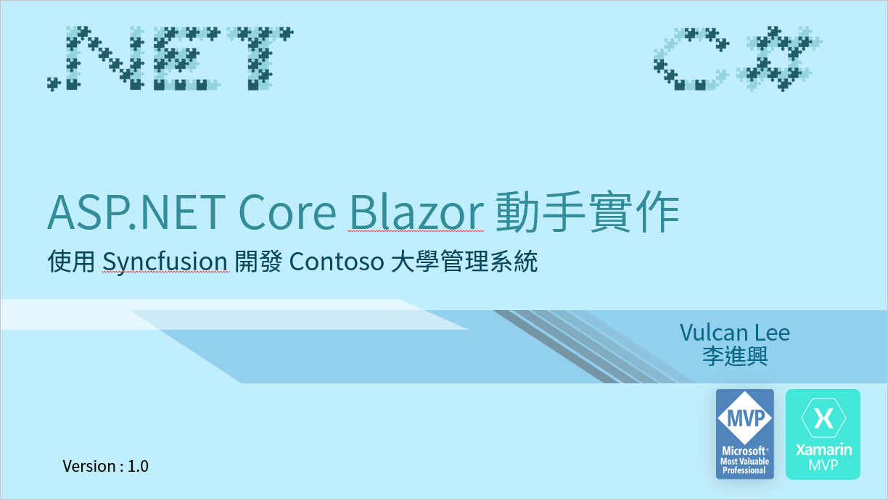

# Blazor Hands-On 教育訓練專案原始碼

這是一份專門針對 ASP.NET Core Blazor Server Side 類型專案所設計的教育訓練開發實作課程。在這份課程中，將會帶領學員從無到有的開發出 Contoso 大學的管理系統，並且將會使用免費的 [MatBlazor](https://www.matblazor.com/) UI 元件與 [Syncfusion](https://www.syncfusion.com/blazor-components) UI 原件來進行設計，在這個系統終將會包含了底下類型的應用：

* 單一資料表的 CRUD 新增、修改、刪除、查詢、搜尋、排序、分頁之設計方式
* 多對一的 CRUD 練習
* 多對多的 CRUD 練習
* 可以開啟視窗，選擇其他資料表內的紀錄

# 專案資料夾

|類型|專案名稱|專案說明|
|-|-|-|
|最終成品|SyncfusionLab|使用 Syncfusion 元件來完成 Contoso University 的資料庫存取應用|
|最終成品|MatBlazorLab|使用 MatBlazor 元件來完成 Contoso University 的資料庫存取應用|
||||
||||
||||

